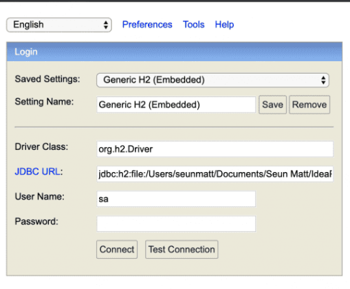

# Java 202 Capstone Project for SkiPP

---
This project should test your knowledge of Spring in creating a simple 
REST API for enlisting students in classes.

The domain classes are already provided; so are the persistence layer (DAO) interfaces, the service layer interfaces,
web controllers, exceptions, and data transfer objects (DTO).

You just need to provide implementations for the DAO and service layers. Also, you need
to provide the implementations of the handlers in the controller classes.

Search for all `TODO` comments. In *IntelliJ IDEA*, you can see these comments from another window:
`View` > `Tool Windows` > `TODO`

Please read the documentation and comments in each class as they will be your guide
on how to complete the required specifications.

Spring Security has also been set up. You just need to secure the endpoints.

To run the application, you can use either Maven or Gradle. Just execute the following command:  

###### Maven
_(for *nix machines)_
```bash
./mvnw spring-boot:run
```
_(for Windows machines)_
```bash
mvnw spring-boot:run
```

###### Gradle
_(for *nix machines)_
```bash
./gradlew bootRun
```
_(for Windows machines)_
```bash
gradlew bootRun
```

You can access the application via http://localhost:8080. You may use any tool you prefer for testing
API calls (e.g., [Postman](https://www.postman.com/), [Fiddler](https://www.telerik.com/fiddler), etc.).

No need to set up the database as that has already been done for you. An H2 database will be used.
You may access http://localhost:8080/h2-console to check the contents of the database:  

  

Just input the following details:
- Driver Class: `org.h2.Driver`
- JDBC URL: `jdbc:h2:mem:skipp`
- User Name: `sa`
- Password: _<blank>_

To run all tests, you can use either Maven or Gradle. Just execute the following command:

###### Maven
_(for *nix machines)_
```bash
./mvnw test
```
_(for Windows machines)_
```bash
mvnw test
```

###### Gradle
_(for *nix machines)_
```bash
./gradlew test
```
_(for Windows machines)_
```bash
gradlew test
```

**Note: The tests will be used to check for completion of requirements.**

### Requirements

- Implement the persistence layer classes.
- Implement the service layer classes.
- Implement the controller handler methods. Provide correct mapping of HTTP methods to each.
- Handle exceptions gracefully; return proper response status codes.
- Provide meaningful messages for error scenarios. 
- HTTP Basic authentication will be used for securing the endpoints.
- For each student created, create a record in the `users` table with the following specs:
  - The `username` should be `ST-` + the `id` from the `students` table.
  - The `password` should be `first_name` + `last_name` from the `students` table.
    - Remove spaces.
    - Use the existing `PasswordEncoder` to encrypt the password before saving to the database.
  - The `role` should be `STUDENT`.
- For each faculty created, create a record in the `users` table with the following specs:
  - The `username` should be `FC-` + the `id` from the `faculty` table.
  - The `password` should be `first_name` + `last_name` from the `faculty` table.
  - The `role` should be `FACULTY`.
- Students: 
  - cannot add/edit/delete rooms, subjects, or sections.
  - can view/list rooms, subjects, and sections.
  - can only view their own details.
  - cannot view/list all other students.
  - can view all sections.
  - can enlist in sections. Validations apply.
  - cannot enlist other students to a section.
- Faculty:
  - can add/view/edit/delete rooms, subjects, or sections.
  - can add/view/edit/delete students or faculty.
  - cannot enlist themselves or any student.
- More detailed instructions (and hints) are included in the source code. Take time to read them.
- **Do NOT modify all the other classes**.

Additional (_optional_) feature to showcase advanced Spring Boot knowledge:
- API Documentation using OpenAPI/Swagger. Use these links as references:
  - https://www.baeldung.com/spring-rest-openapi-documentation
  - https://www.baeldung.com/springdoc-openapi-form-login-and-basic-authentication
  - https://stackoverflow.com/questions/65811073/how-to-set-description-to-a-field-using-swagger-openapi-annotations

### Grading Criteria

Functionality (60%):
- Endpoint Implementation: _Were all required endpoints implemented correctly according to the provided interface classes?_
- Request Handling: _Do the implemented endpoints handle requests properly? Including request parameters, request bodies, headers, and response codes?_

Code Quality (40%):
- Readability: _Were proper coding conventions followed? Is the code well-structured and easy to understand?_
- Error Handling: _Were errors and exceptions handled gracefully? Are meaningful error messages provided to clients?_
- Coding Best Practices: _Were best practices such as proper naming conventions, avoiding code duplication, and SOLID principles followed?_

#### Bonus points

- Documentation (10%): 
  - _Is OpenAPI/Swagger documentation available?_ (5%)
  - _Do the endpoints and entities have user-friendly descriptions?_ (5%)